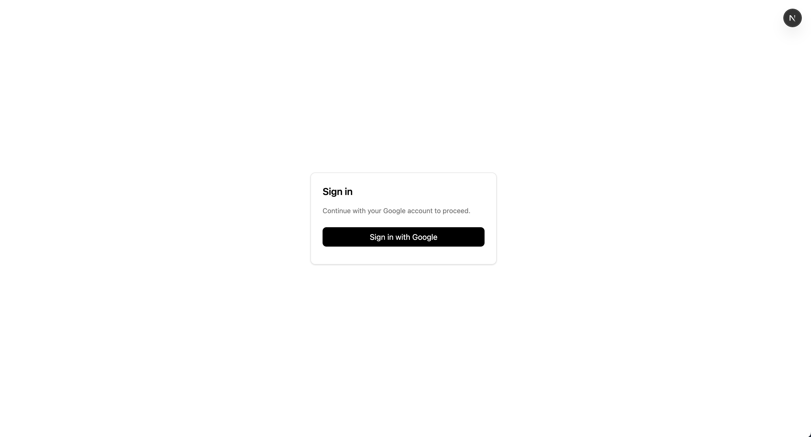
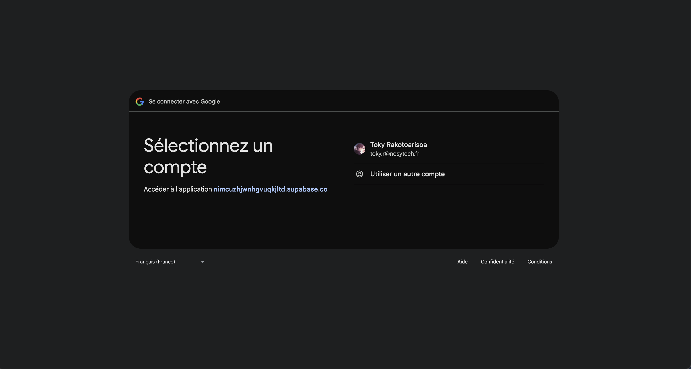
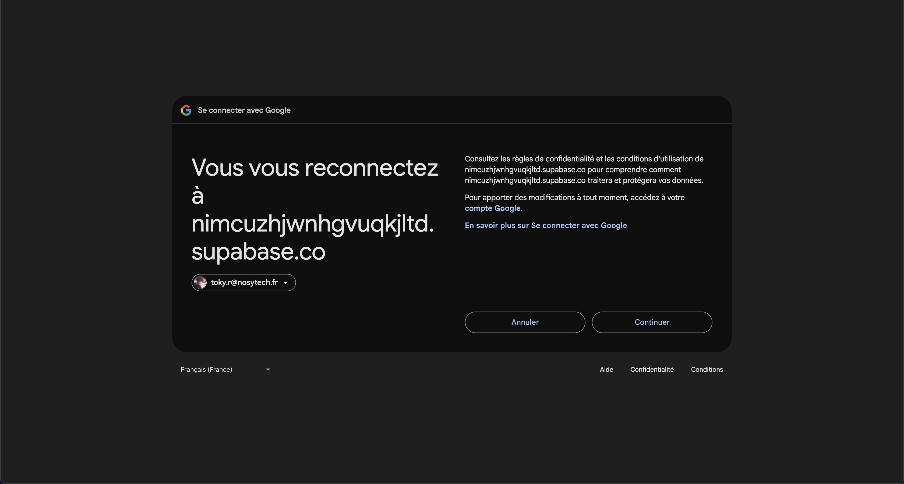
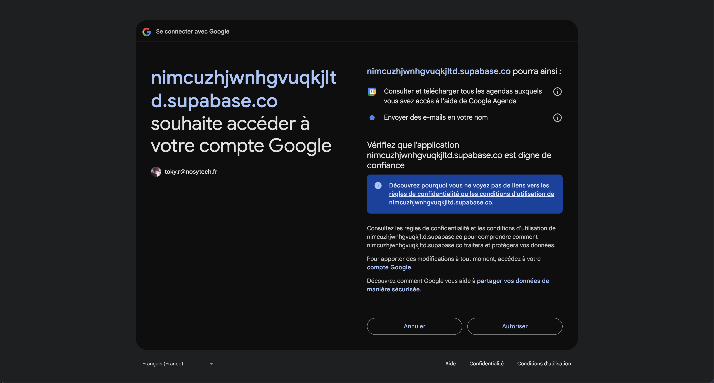
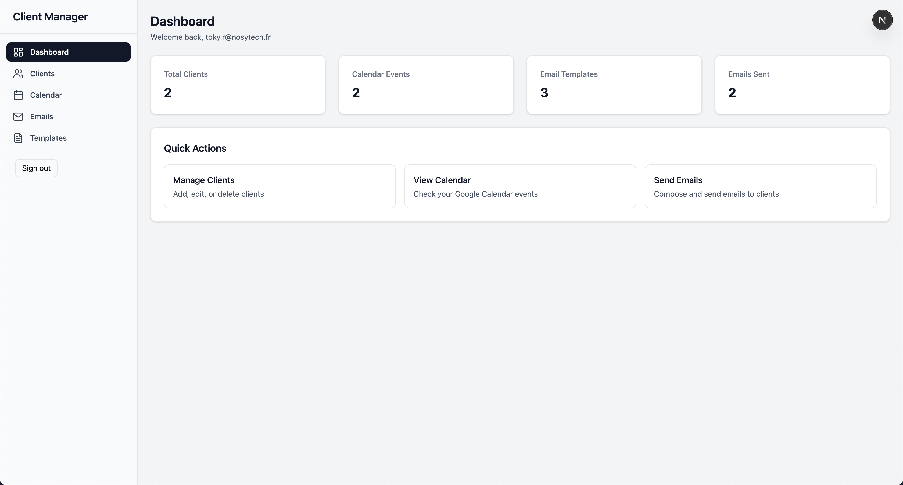
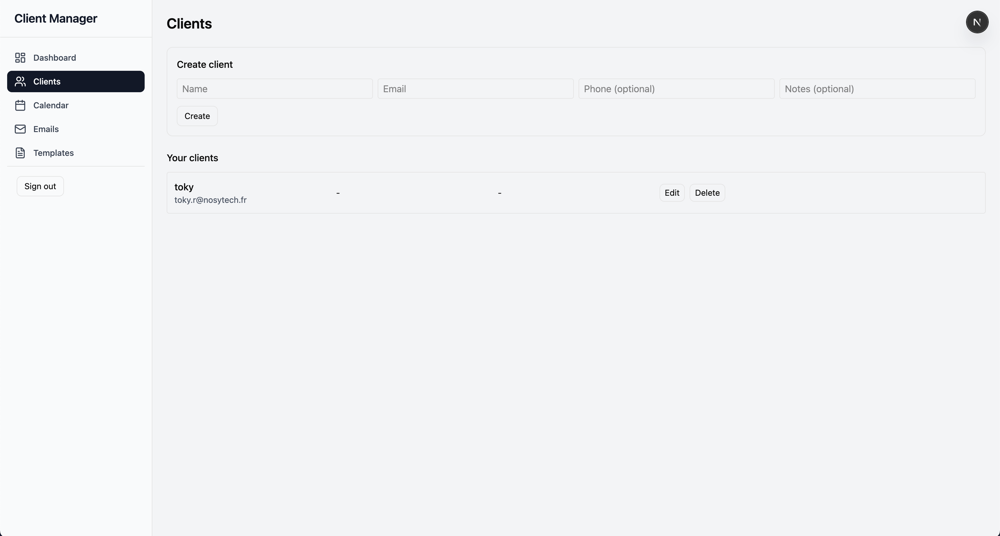
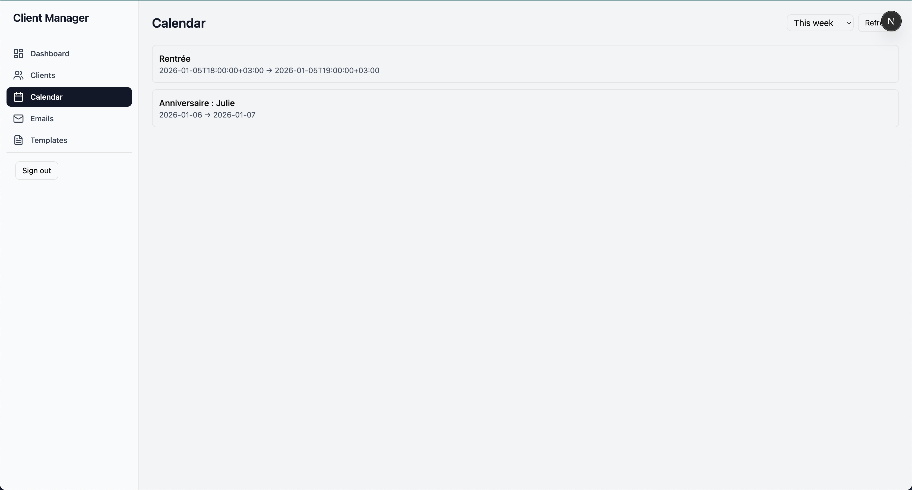
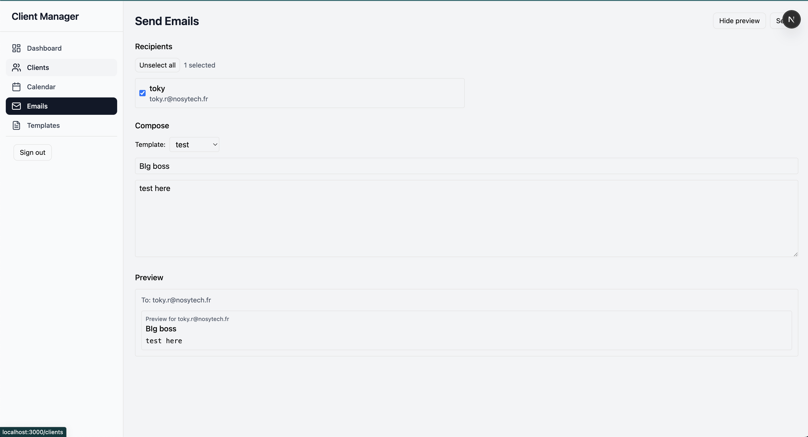
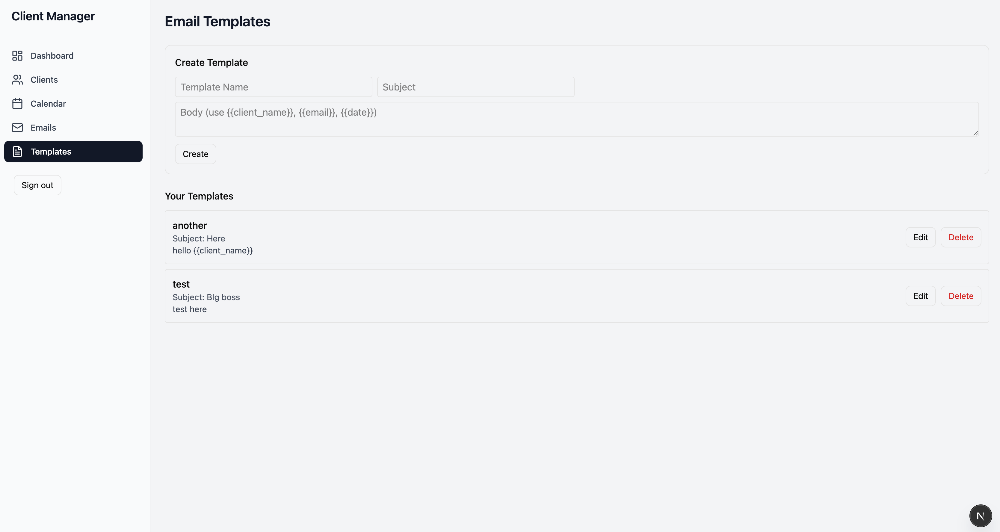

# Client Management Application

A full-stack web application for managing clients with Google Calendar synchronization and Gmail integration.

## 🚀 Features

- **Google OAuth Authentication** - Secure login with Google account
- **Client Management** - Full CRUD operations for client database
- **Google Calendar Sync** - Synchronize and display calendar events
- **Email Campaigns** - Send personalized emails via Gmail API
- **Email Templates** - Create and reuse email templates with dynamic variables
- **Modern UI** - Responsive design with Tailwind CSS

## 🛠 Tech Stack

- **Frontend**: Next.js 16, React 19, TypeScript, Tailwind CSS
- **Backend**: Next.js API Routes, Supabase
- **Database**: PostgreSQL via Supabase
- **Authentication**: Supabase Auth + Google OAuth
- **External APIs**: Google Calendar API, Gmail API
- **State Management**: Tanstack React Query
- **Validation**: Zod
- **Architecture**: Services + Repositories pattern

## 📋 Prerequisites

- Node.js 18+ 
- Google Cloud Project with APIs enabled
- Supabase project

## 🚀 Installation

### 1. Clone the repository

```bash
git clone <repository-url>
cd client-mgmt
```

### 2. Install dependencies

```bash
npm install
```

### 3. Environment Setup

Copy the environment file and configure your variables:

```bash
cp .env.example .env.local
```

Configure the following variables:

```env
# Supabase Configuration
NEXT_PUBLIC_SUPABASE_URL=your-supabase-url
NEXT_PUBLIC_SUPABASE_ANON_KEY=your-supabase-anon-key
SUPABASE_SERVICE_ROLE_KEY=your-supabase-service-role-key

# Google OAuth (configured in Supabase)
GOOGLE_CLIENT_ID=your-google-client-id
GOOGLE_CLIENT_SECRET=your-google-client-secret
```

### 4. Google Cloud Setup

1. **Create a Google Cloud Project**
   - Go to [Google Cloud Console](https://console.cloud.google.com/)
   - Create a new project

2. **Enable APIs**
   - Google Calendar API
   - Gmail API

3. **Configure OAuth Consent Screen**
   - Go to APIs & Services > OAuth consent screen
   - Configure with your app details
   - Add scopes:
     - `https://www.googleapis.com/auth/calendar.readonly`
     - `https://www.googleapis.com/auth/gmail.send`

4. **Create OAuth Credentials**
   - Go to APIs & Services > Credentials
   - Create OAuth 2.0 Client ID
   - Add authorized redirect URI: `http://localhost:3000/auth/callback`

### 5. Supabase Setup

1. **Create Supabase Project**
   - Go to [supabase.com](https://supabase.com)
   - Create a new project

2. **Configure Google Auth**
   - Go to Authentication > Providers > Google
   - Enable Google provider
   - Add your Google Client ID and Secret
   - Set redirect URL: `http://localhost:3000/auth/callback`

3. **Run Database Migrations**
   ```bash
   # Apply the migration files from supabase/migrations/
   # Or use Supabase CLI: supabase db push
   ```
   #### using Supabase CLI
   - Link your supabase project by typing
   ```bash
    supabase link
   ```
   - To populate your db 
   ```bash
    supabase db push
   ```


### 6. Run the Application

```bash
npm run dev
```

Open [http://localhost:3000](http://localhost:3000) in your browser.


## Screenshots of the application

   
    
    
    
    
    
    
    
    
    

## 📊 Database Schema

### Clients Table

```sql
CREATE TABLE clients (
  id UUID PRIMARY KEY DEFAULT gen_random_uuid(),
  user_id UUID NOT NULL REFERENCES auth.users(id) ON DELETE CASCADE,
  name TEXT NOT NULL,
  email TEXT NOT NULL,
  phone TEXT,
  notes TEXT,
  created_at TIMESTAMPTZ DEFAULT NOW(),
  updated_at TIMESTAMPTZ DEFAULT NOW()
);
```

### User Tokens Table

```sql
CREATE TABLE user_tokens (
  user_id UUID PRIMARY KEY REFERENCES auth.users(id) ON DELETE CASCADE,
  provider TEXT NOT NULL DEFAULT 'google',
  access_token TEXT,
  refresh_token TEXT,
  expires_at TIMESTAMPTZ,
  updated_at TIMESTAMPTZ DEFAULT NOW()
);
```

### Email Templates Table

```sql
CREATE TABLE email_templates (
  id UUID PRIMARY KEY DEFAULT gen_random_uuid(),
  user_id UUID NOT NULL REFERENCES auth.users(id) ON DELETE CASCADE,
  name TEXT NOT NULL,
  subject TEXT NOT NULL,
  body TEXT NOT NULL,
  created_at TIMESTAMPTZ DEFAULT NOW(),
  updated_at TIMESTAMPTZ DEFAULT NOW()
);
```

## 🏗 Architecture

### Project Structure

```
├── app/                    # Next.js App Router
│   ├── api/               # API Routes
│   ├── auth/              # Authentication pages
│   ├── calendar/          # Calendar page
│   ├── clients/           # Client management
│   ├── emails/            # Email sending
│   ├── templates/         # Email templates
│   └── dashboard/         # Main dashboard
├── components/            # Reusable UI components
├── hooks/                # Custom React hooks
├── lib/                  # Utilities and configurations
│   ├── errors/           # Custom error classes
│   ├── logger.ts         # Logging utility
│   ├── api-handler.ts    # API middleware
│   └── zod/             # Validation schemas
├── repositories/         # Data access layer
├── services/            # Business logic layer
└── test/               # Test files
```

### Data Flow

```
Client Component → API Route → Service → Repository → Database
```

- **API Routes**: Handle HTTP requests, validation, authentication
- **Services**: Business logic, external API integration
- **Repositories**: Database operations, data access

## 🔐 Security Features

- **Row Level Security (RLS)** on all database tables
- **OAuth 2.0** with Google
- **Token refresh mechanism** for Google APIs
- **Input validation** with Zod on client and server
- **Ownership verification** - users can only access their own data

## 📧 Email Templates

Templates support dynamic variables:

- `{{client_name}}` - Client's name
- `{{email}}` - Client's email address  
- `{{date}}` - Current date

Example template:
```
Subject: Meeting Reminder - {{date}}

Hello {{client_name}},

Just a reminder about our upcoming meeting. 
I'll contact you at {{email}} if there are any changes.

Best regards
```

## 🧪 Testing

```bash
# Run unit tests
npm run test

# Run tests in watch mode
npm run test:watch

# Run tests with coverage
npm run test:coverage
```

## 📝 API Endpoints

### Authentication
- `GET /auth/callback` - Sync Google tokens after OAuth

### Clients
- `GET /api/clients` - List user's clients
- `POST /api/clients` - Create new client
- `PATCH /api/clients/[id]` - Update client
- `DELETE /api/clients/[id]` - Delete client

### Calendar
- `GET /api/calendar/events` - Get calendar events

### Emails
- `POST /api/emails/send` - Send emails

### Templates
- `GET /api/templates` - List email templates
- `POST /api/templates` - Create template
- `PATCH /api/templates/[id]` - Update template
- `DELETE /api/templates/[id]` - Delete template

## 🚀 Deployment

### Environment Variables for Production

```env
NODE_ENV=production
NEXT_PUBLIC_APP_URL=https://your-domain.com
NEXT_PUBLIC_SUPABASE_URL=your-production-supabase-url
NEXT_PUBLIC_SUPABASE_ANON_KEY=your-production-anon-key
SUPABASE_SERVICE_ROLE_KEY=your-production-service-role-key
GOOGLE_CLIENT_ID=your-production-google-client-id
GOOGLE_CLIENT_SECRET=your-production-google-client-secret
```

## 📄 License

This project is licensed under the MIT License.

## 🆘 Troubleshooting

### Google OAuth Issues
- Ensure redirect URIs match in both Google Console and Supabase
- Check that OAuth consent screen is configured
- Verify required scopes are included

### Database Issues
- Run migrations if tables are missing
- Check RLS policies if data access is restricted
- Verify Supabase connection strings

### Token Refresh Issues
- Check that refresh tokens are being stored
- Ensure Google OAuth is configured for offline access
- Monitor token expiration in user_tokens table

